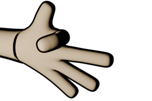
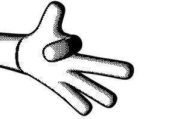
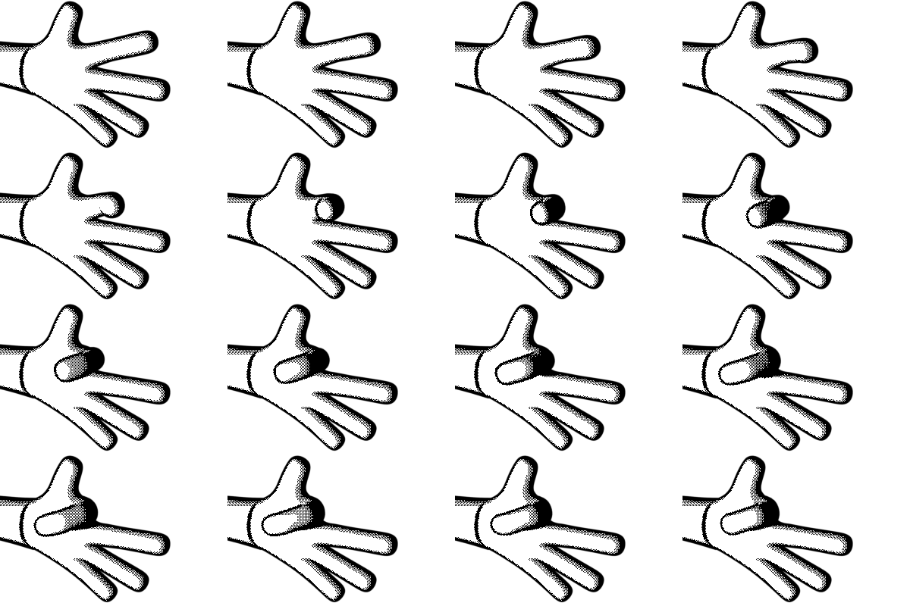
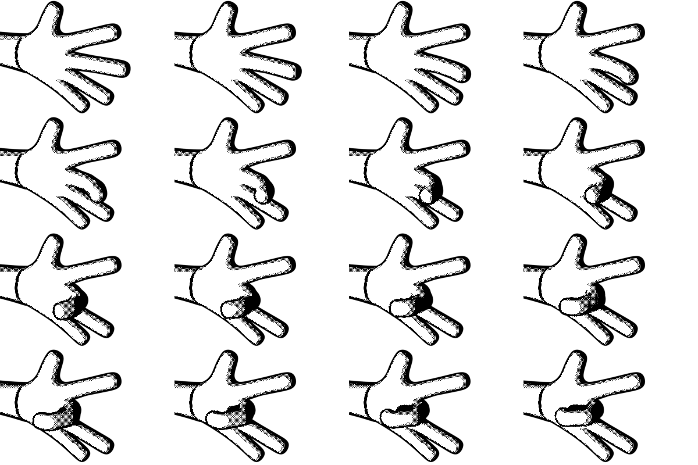
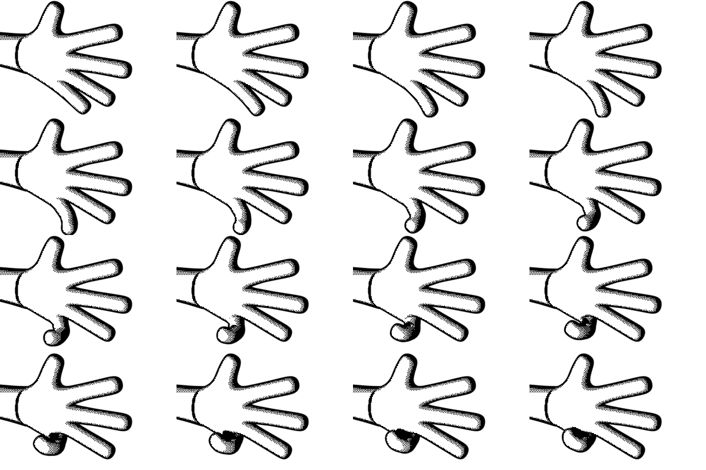
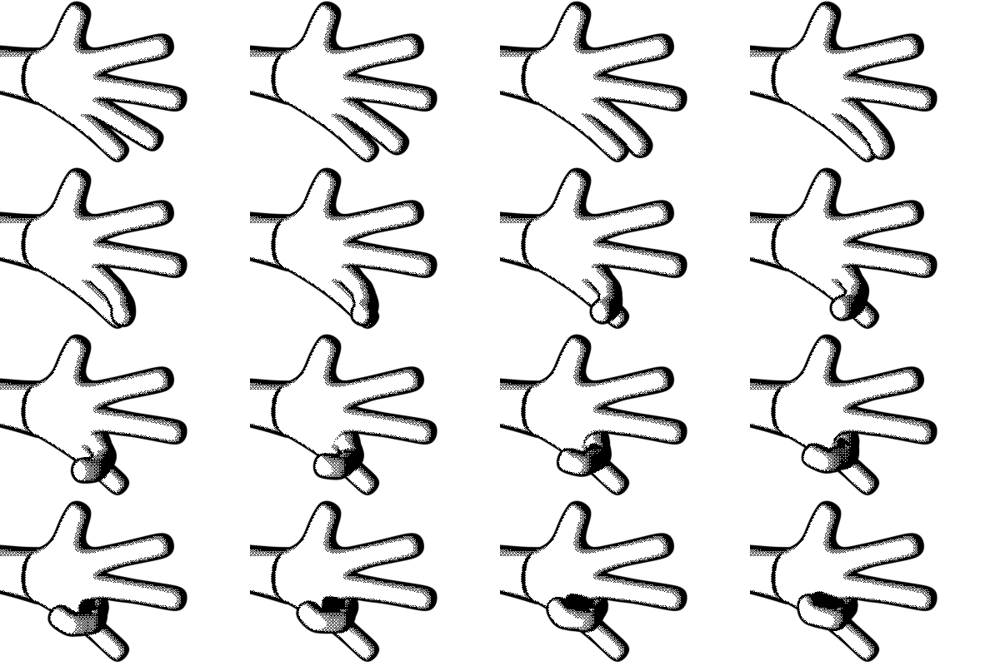

# <h1 align="center">SPRITE DITHERER</h1>

<p align="center">
   <b>An automated Blender-to-sprite pipeline for generating dithered hand pose animations. Built for rapid prototyping of gesture-based games, with Playdate development in mind.</b><br>
</p>

---

<p align="center">
    
    
    
</p>
<p align="center">
    
    
    
</p>

---

## Table of Contents
1. [Ready Set Tool](#ready-set-tool)
2. [Saving Myself From What Feels Like a Mythical Torture](#saving-myself-from-what-feels-like-a-mythical-torture)
3. [The Pipeline Architecture](#the-pipeline-architecture)
4. [Usage Guide](#usage-guide)
5. [Configuration Deep Dive](#configuration-deep-dive)
6. [Technical Breakdown](#technical-breakdown)
7. [Output Structure](#output-structure)
8. [Troubleshooting](#troubleshooting)
9. [Next (and Neverending) Steps](#next-and-neverending-steps)

<br>

## Ready Set Tool

**Hand Ditherer** is an automated pipeline that transforms a rigged 3D hand model in Blender into sets of dithered sprite animations. I built this as part of a prototyping process I'm undergoing for a Playdate game, based on a hand model. Creating the sprites manually by setting things up in Blender, then rendering, then dithering... The whole manual pipeline was crushing my soul, so I decided to dabble in some tooling and wrote a couple of Python scripts to help me automate the process.

Right now, it is a pretty basic tool that works specifically for my intended purposes (i.e., it's not built to function as some universal tool), but I built it with the prospect of being able to feed it different hand models. What I mean by this is that, down the line, if I remodel the hand (which I've already done, I have multiple versions of it) or go crazy with the design options (different number of fingers, addition of ornaments, who knows), I want this tool to keep working for my prototyping. I think it will, although some adjustments might be needed when the time comes. For now, it does what I need it to do:

- Opens my blender file
- Sets up the rendering environment
- Snapshots 16 raw frames for each finger of a human hand, lerping the rotation of the targeted finger along the 16 steps between the straight, initial position and the final, fully curled one
- Takes those raw frames and process them via a dithering script written directly in Python
- Builds spritesheets for each finger (4x4)

The dithering process, I'm sure, will change if the prototype trascends into a more serious project (fingers = crossed), but for now is good enough to let me try stuff in my physical Playdate and imagine what it would look like in an ideal world, in the country of Things Well Done. I can change the camera position and angle, alternate hands and try different base rendering approaches (preprocessing and whatnot), and this would still give me a nice set of 16-frame series of sprites, so for now I'm satisfied. 

<p align="center">
  
  
  <br>
</p>

The tool was born out of necessity while prototyping gesture-based games for the Playdate console, where:
- **1-bit graphics** require careful dithering
- **Frame budgets** demand optimized sprites
- **Rapid iteration** is crucial for testing game feel

Instead of the tedious workflow of: *Pose bone → Render → Export → Dither in Photoshop → Rename → Repeat × 80*, this pipeline does it all with a single script execution.

In all fairness, there were also two major inputs in the my decision to spend a whole day scripting this tool. One was a job interview process for a tools programmer (which ended in, as everything lately, a rejection; ***if you want to give me a job, please don't hesitate, I need it***). The other one was the devlog written by **Lucas Pope** for his [***Mars After Midnight***](https://dukope.itch.io/mars-after-midnight/devlog) itch.io page, to which I came back as part of my Playdate landscape and aesthetics research. The way he describes his processes and tooling is very inspiring to me, so I wanted to take a similar lane and start taking this tool approach to what has traditionally been very manual processes for me (across activities: programming, illustrating, video editing, ...). As I harness my programming superpowers, it makes sense to put them to good use, and this Playdate prototype I'm working in felt like the perfect occasion.

So, yeah, after renaming for the hundreth time a file by hand this last weekend, I stopped and thought to myself that tooling was the most direct way to happiness. And I'm happy, so I guess I was not entirely wrong.

<br>

## Saving Myself From What Feels Like a Mythical Torture
Think of my previous pipeline as a sysphian loop of making and remaking sprites to find out that they need this or that tweak and all the images had to be done. Or some weird bird pecking at my metaphorical entrails while I mindlessly click and type the same thing over and over again.

### The Manual Workflow Was Hell

When building a hand-based puppet game prototype, I needed sprites for 5 fingers, each with 16 curl positions. That's **80 frames minimum**. The old workflow looked like:

1. Open Blender
2. Manually rotate bone to pose 1
3. Render frame
4. Export PNG
5. Open in image editor
6. Apply dithering (which I was doing via (***Dither Me This***)[https://doodad.dev/dither-me-this/])
7. Save with correct naming
8. **Repeat 79 more times**

This was: **Time-consuming, error-prone, non-iterative, soul-crushing, and plainly misserable**. Also, the need to do things in a more automated, professional way is always floating around my messy way of building stuff. Serious projects require serious tools. Etc.

### The Automated Solution

Now the workflow is:

1. Configure finger bones in `finger_config.py`
2. Run `python3 blender/run_pipeline.py`
3. Stare into the void
4. Return to 80 perfectly rendered, dithered, and organized sprites



<br>


## The Pipeline Architecture

The system is built around **separation of concerns** and **modularity**. Think of it as three independent workers on an assembly line:

```
┌─────────────────────────────────────────────────────────────┐
│                        BLENDER STAGE                        │
│                   (export_all_fingers.py)                   │
│                                                             │
│  1. Load .blend file                                        │
│  2. For each finger in finger_config:                       │
│     - Pose bone through 16 rotation steps                   │
│     - Render frame                                          │
│     - Save to output/raw/{finger}/                          │
│  3. Generate metadata (angles, frame indices)               │
└─────────────────────────────────────────────────────────────┘
                            ↓
┌─────────────────────────────────────────────────────────────┐
│                      PROCESSING STAGE                       │
│  						(dither.py)                           │
│                                                             │
│  1. Load raw PNGs                                           │
│  2. Convert to grayscale                                    │
│  3. Apply ordered dithering (Bayer matrix)                  │
│  4. Save to output/dithered/{finger}/                       │
└─────────────────────────────────────────────────────────────┘
                            ↓
┌─────────────────────────────────────────────────────────────┐
│                       PACKING STAGE                         │
│  					(pack_spritesheet.py)                     │
│                                                             │
│  1. Load dithered sprites                                   │
│  2. Arrange in grid (configurable columns)                  │
│  3. Generate Playdate-compatible sprite sheets              │
│  4. Save metadata for animation playback                    │
└─────────────────────────────────────────────────────────────┘
```

### Why This Architecture?

**Modularity**: Each stage can run independently. Already have renders? Skip Blender and just dither. Need to test dithering settings? Run only that stage. The magic of tooling knows no boundaries, and it's power shall be harnessed until the end of (my) times.

**Debugging**: When something breaks, I can easily track exactly where to look. Blender errors stay in Blender, image processing errors stay in processing, etc.

**Flexibility**: I can play around with different dithering processes, add intermediate steps, expand the tool later on (which I will need).

<br>

## Usage Guide

### Quick Start: Run Everything

If for whatever reason you want to use/test this tool, the simplest way to use the pipeline is to run everything at once:

```bash
python3 blender/run_pipeline.py
```

All while making sure you have these installed:
- **Blender 3.0+** (tested on 5.0.1)
- **Python 3.8+**
- **Pillow** (PIL): `pip install Pillow`
- **NumPy**: `pip install numpy`

This will:
1. Open Blender in background mode
2. Render all fingers (80 frames total)
3. Dither every frame
4. Pack sprite sheets
5. Generate metadata

### Running Individual Stages

#### 1. Blender Export Only

If you just want to render frames without dithering:

```bash
blender --background blender/protoHand.blend --python blender/export_all_fingers.py
```

Or from inside Blender's Python console:
```python
filename = "/path/to/hand_ditherer/blender/export_all_fingers.py"
exec(compile(open(filename).read(), filename, 'exec'))
```

#### 2. Dithering Only

Already have raw renders? Just dither them:

```bash
python3 processing/dither.py \
  --input output/raw/index \
  --output output/dithered/index \
  --matrix 4 \
  --black-cutoff 10 \
  --white-cutoff 170
```

**Parameters:**
- `--matrix`: Bayer matrix size (2 or 4, might expand to 8)
- `--black-cutoff`: Pixels darker than this become pure black
- `--white-cutoff`: Pixels lighter than this become pure white

> the cutoffs are there because at this early prototyping stage I want clean and clear sprites with lots of white masses and thick black outlines, with just a hint of dithered shadows to convey the volume of the hand and its fingers.

#### 3. Sprite Sheet Packing Only

Have dithered sprites? Pack them:

```bash
python3 processing/pack_spritesheet.py \
  --input output/dithered/index \
  --output output/spritesheets/index_sheet.png \
  --width 300 \
  --height 200 \
  --columns 4
```

<br>

---

## Configuration Deep Dive

### Finger Configuration (`finger_config.py`)

This is the brain of the operation. It tells the pipeline **which bones to animate** and **how to animate them**.

```python
FINGERS = {
    "index": {
        "bone_name": "index_base",      # Bone to rotate
        "start_angle": 0.0,             # Starting rotation (radians)
        "end_angle": -1.3,              # Ending rotation (radians)
        "rotation_axis": "x",           # Rotation axis (x, y, or z)
        "pose_count": 16,               # Number of frames
    },
    # ... more fingers
}
```

#### Understanding the Settings

**bone_name**: The exact name of the bone in your Blender armature. To find it:
1. Open your `.blend` file
2. Select the armature
3. Enter Pose Mode
4. Select the bone you want
5. Check the name in the Outliner

**start_angle / end_angle**: Rotation in **radians**, not degrees. Quick reference:
- 0° = 0 rad
- 45° ≈ 0.785 rad
- 90° ≈ 1.571 rad
- -90° ≈ -1.571 rad

> I work with negative values because in Blender's coordinate system, finger curl typically happens in the negative X direction. Or at least that is the case when you position the hand model as I do, with fingers curling towards the camera. 

**rotation_axis**: Most finger curls happen on the X axis, just in case some other rotations are needed in the future:
- `"y"` for sideways finger movement
- `"z"` for finger spreading

> 'Y' axis will most likely never be used, but the finger spreading is important regarding what the game being prototyped aims to be. My Godot prototype for this needed it, at least.

**pose_count**: More frames = smoother animation but larger file size. 16 is a sweet spot for Playdate and it's ways to fake 3D by animating pre-authored sprites (what I'm doing with this tool, basically).

### Dithering Configuration

In `finger_config.py`:

```python
DITHER_CONFIG = {
    "matrix": 4,              # Bayer matrix size
    "black_cutoff": 10,       # Pure black threshold
    "white_cutoff": 170,      # Pure white threshold
}
```

#### Tweaking Dithering for Your Art Style

<p align="center">
  
  <br>
  <i>Different dithering settings can dramatically change the look</i>
</p>

**matrix size**: Controls dithering granularity
- `2`: Coarse, retro look (4×4 threshold matrix)
- `4`: Balanced detail (8×8 threshold matrix) - **Recommended**
- `8`: Who knows, I haven't tried it

**black_cutoff**: Lower values preserve more dark detail
- `0-20`: Keeps shadows in black areas
- `20-50`: More aggressive black thresholding

**white_cutoff**: Higher values preserve more light detail
- `200-255`: Keeps highlights in white areas
- `150-200`: More aggressive white thresholding

> Some tips: for outlined sprites (like the hand), lower `white_cutoff` (170-200) keeps solid white masses instead of dithered gray areas. The `black_cutoff` is in place, also, to avoid having white spots inside the black masses, which tends to happen if you set this value to something closer to the max `255`.

<br>


## Technical Breakdown

### The Blender Side: How Rendering Works

The export script (`export_all_fingers.py`) is where the magic happens. Let's break down the key concepts:

#### Dynamic Library Loading

The script needs to work both:
- As a file run from terminal (`blender --python script.py`)
- As text loaded in Blender's text editor (no `__file__` variable)

```python
try:
    SCRIPT_DIR = os.path.dirname(os.path.abspath(__file__))
except NameError:
    # When run from Blender's text editor, __file__ doesn't exist
    SCRIPT_DIR = os.path.dirname(bpy.data.filepath)
```

This pattern ensures the script can find `finger_config.py` regardless of how it's executed.

#### Bone Rotation via Linear Interpolation

For smooth animation, I use the good old `lerp` (linear interpolation) to calculate intermediate angles, as it ensures evenly-spaced angles. With 16 frames from 0 to -1.3 radians:

```python
def lerp(a, b, t):
    return a + (b - a) * t

# In the render loop
for i in range(pose_count):
    t = i / (pose_count - 1)  					# Normalized progress: 0.0 to 1.0
    angle = lerp(start_angle, end_angle, t)
    
    pose_bone.rotation_euler.x = angle
    bpy.context.view_layer.update() 			 # Apply the pose
    bpy.ops.render.render(write_still=True)
```
```
- Frame 0: 0.0 rad
- Frame 8: -0.65 rad (halfway)
- Frame 15: -1.3 rad (fully curled)
```

<br>

#### Metadata Generation

Every render generates a JSON metadata file:

```json
{
  "finger": "index",
  "bone": "index_base",
  "frames": [
    {
      "index": 0,
      "angle": 0.0,
      "filename": "index_00.png"
    },
    // ...
  ]
}
```

This metadata is crucial for:
- **Debugging**: Know exactly which angle each frame represents
- **Animation**: Map game input values to sprite frames
- **Version control**: Track what render settings produced which output

> As the prototype grows and things get automated, having this trail of metadata is, I think, will keep the madness at bay. Or maybe not, maybe all paths lead to the losing of the concious self. Stay tuned for updates on this.

<br>

### The Processing Side: Ordered Dithering

The dithering algorithm uses a **Bayer matrix** for ordered dithering. This creates the characteristic crosshatch pattern you see in 1-bit graphics.

#### How Bayer Matrices Work

A Bayer matrix is a threshold map. For each pixel, we compare its grayscale value against the matrix:

```python
BAYER_4x4 = np.array([
    [ 0,  8,  2, 10],
    [12,  4, 14,  6],
    [ 3, 11,  1,  9],
    [15,  7, 13,  5]
])
```

For a pixel at position `(x, y)`:
1. Get the grayscale value (0-255)
2. Get the threshold from `BAYER_4x4[y % 4, x % 4]`
3. If pixel > threshold: white pixel, else: black pixel

Easy once you do your research (the values of the Bayer matrix are fixed). Practically arcane magic for me at the beginning of today.

#### The Three-Zone Approach

Raw dithering can look muddy, so some more research brought me to the **three zone approach**. Really, this was more the result of that necessity of mine to have a very white-and-black dithered sprites, avoiding too much noise so that the 1-bit based display in the Playdate looks good (and Playdate-like, i.e., how a lot of incredible designers and artists have been outputting little gems of games in it's ecosystem):

```python
BLACK_CUTOFF = 10
WHITE_CUTOFF = 170

if pixel <= BLACK_CUTOFF:
    output = 0 					# Pure black, no dithering -> OUTLINE
elif pixel >= WHITE_CUTOFF:
    output = 255				# Pure white, no dithering -> INNER MASSES
else:
    							# Middle zone: apply dithering -> SHADOWS
    threshold = BAYER_4x4[y % 4, x % 4]
    output = 255 if pixel > threshold else 0
```

This (hopefully) gives:
- Readable shapes
- clean masses
- Dithered midtones/shadows



<br>

### The Subprocess Bridge

The Blender script and Python dithering script are separate processes. Communication happens via subprocess calls:

```python
# In export_all_fingers.py
result = subprocess.run([
    "python3", 
    "processing/dither.py",
    "--input", raw_output,
    "--output", dithered_output,
    # ... more args
], capture_output=True, text=True)

if result.returncode != 0:
    print("STDERR:", result.stderr)
    raise RuntimeError(f"Dithering failed")
```

**Why subprocess instead of importing?** Glad you asked: Blender uses its own bundled Python. System Python has different packages (like Pillow). Subprocess calls use **system Python**, which has our dependencies. I was having a lot of headaches debugging the initial development steps of this tool, and I found out that the different in Python bundles was the culprit. Things will never be simple and easy, apparently.

<br>


## Output Structure

After a successful pipeline run:

```
output/
├── raw/                          # Unprocessed Blender renders
│   ├── thumb/
│   │   ├── thumb_00.png
│   │   ├── thumb_01.png
│   │   ├── ...
│   │   └── thumb_metadata.json
│   ├── index/
│   ├── middle/
│   ├── ring/
│   └── pinky/
│
├── dithered/                     # Processed 1-bit sprites
│   ├── thumb/
│   │   ├── thumb_00_dithered.png
│   │   ├── thumb_01_dithered.png
│   │   └── ...
│   ├── index/
│   ├── middle/
│   ├── ring/
│   └── pinky/
│
├── spritesheets/                 # Packed animations
│   ├── thumb_sheet.png
│   ├── thumb_sheet_metadata.json
│   ├── index_sheet.png
│   ├── index_sheet_metadata.json
│   └── ...
│
└── export_summary.json           # Pipeline execution report
```

### Follow the ~~Money~~ JSON

`export_summary.json` tracks the entire pipeline:

```json
{
  "thumb": {
    "raw": "/path/to/output/raw/thumb",
    "dithered": "/path/to/output/dithered/thumb",
    "status": "success"
  },
  "index": {
    "status": "failed",
    "error": "Bone 'index_base' not found"
  }
}
```

If something fails, this file tells me **exactly** what and **exactly** where. How to fix it is not included, sadly, so some work needs to be done if running the script doesn't result in sprites gallore.

<br>


## Next (and Neverending) Steps

This tool was built for rapid prototyping, but there's room to grow:

### Most needed stuff:
- [ ] **Render Masking**: I need to find a way to make each finger sprite just contain it's finger. I ***don't know*** how automatable this will be, as I have to research how to effectively mask stuff in Blender (I can do it in the `compositor`, but maybe there are some easier tricks, we'll see).

> Down the line I'd like to switch to a more detailed, artisan-y sprite creating pipeline (drawing by hand, maybe), but the matter of the fact is that I need to split the sprites in `sleeve`, `palm` and each of the fingers, then code the rendering composition in the Playdate SDK. This announces Pain and Trouble, specially regarding the stitching and superposing of the sprites. The more aspects of this that I can solve with code and tooling, the better. My sanity will thank me. And I'll thank her back.

### Planned Features
- [ ] **GUI configurator**: Visual bone selector and rotation preview
- [ ] **Animation preview**: Scrub through frames before export
- [ ] **Multiple dither algorithms**: Floyd-Steinberg, Atkinson, custom matrices
- [ ] **Color palette support**: Not just 1-bit, but limited color palettes
- [ ] **Gesture recognition data**: Export hand pose data for ML training
- [ ] **Playdate SDK integration**: Direct sprite table generation

> How many of these will be done? Ah, who's to tell... Necessity will guide the tooling hand

### Playdate-Specific Features
- [ ] Sprite table metadata generation
- [ ] Optimized 1-bit PNG compression
- [ ] Frame timing suggestions based on animation curve
- [ ] Multiple hand models (left/right, different skin tones, different species, etc.)

> These are more on the "if the game advances to something more serious" side of things, but hey, at least no one can accuse me of not being a ***planner*** and giving into the chaos that dwells in the space between my ears.

### Community Ideas Welcome!

This tool exists because I needed it. If you're using it and hit a roadblock, or you have ideas for improvements, **please open an issue**. Help me help myself, which I often find myself (again) in the most dire need for it.

<br>

---
> *Built with Python, Blender, and the burning desire to never manually dither another sprite.*



<br>

> PD: I also included a `cleanup.sh` script to delete all the output files. Mostly to be executed before pushing to the remote repo. 
